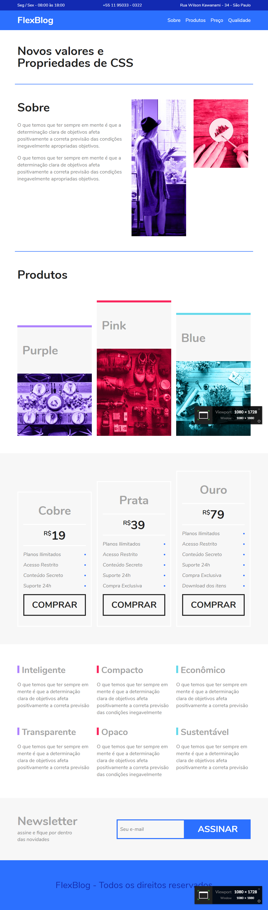

# Flexblog

## Projeto prático FlexBlog feito através do curso de CSS Flexbox da [Origamid](https://www.origamid.com/curso/css-flexbox)

## Link do Projeto: [FlexBox](https://marcelo-rafael.github.io/css-flexbox-projeto-flexblog/)

